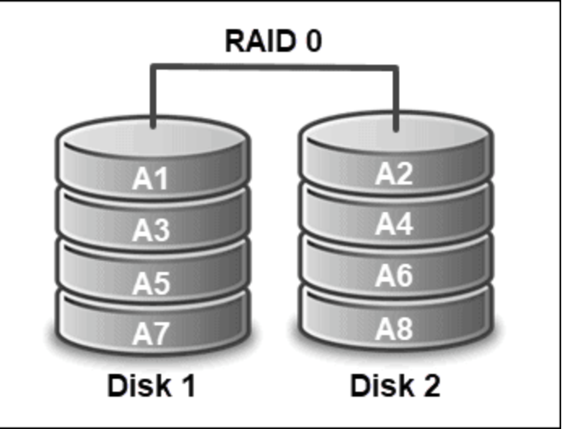
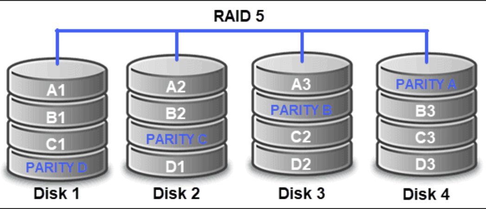
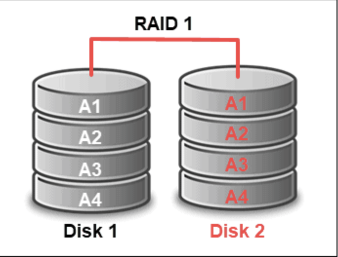
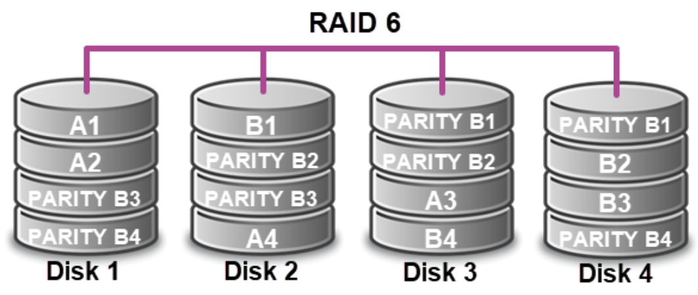
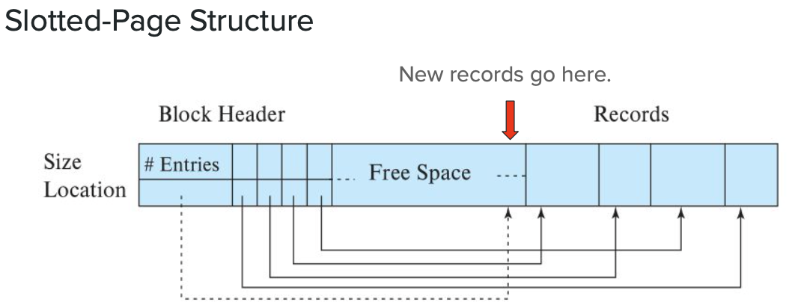
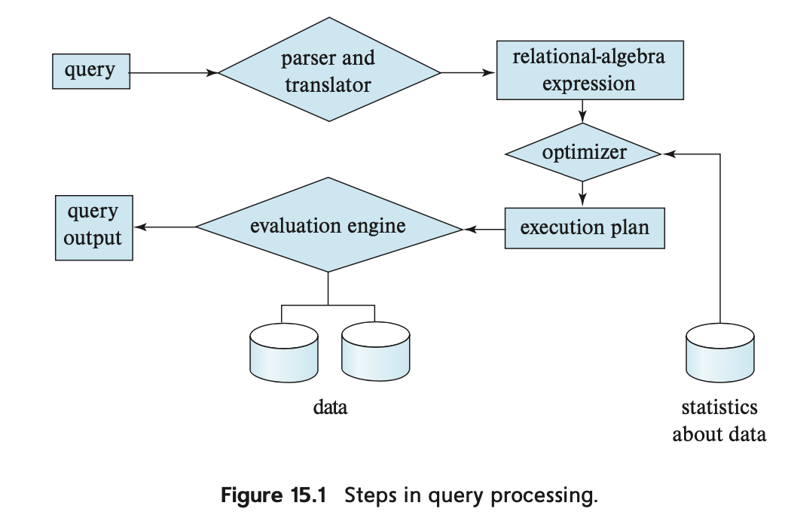
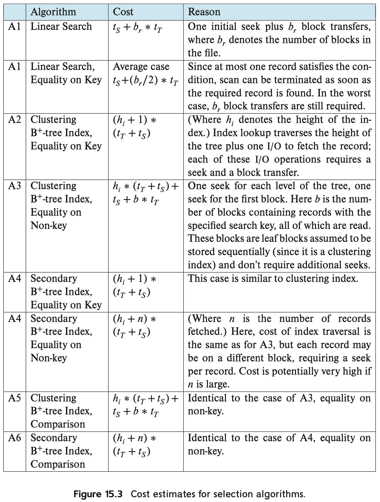

## Content
- [Content](#content)
- [12. Physical Data Storage](#12-physical-data-storage)
  - [Primary Storage (Volatile + Fast)](#primary-storage-volatile--fast)
    - [Cache (KB-MB)](#cache-kb-mb)
    - [Main memory (RAM) (GB)](#main-memory-ram-gb)
  - [Secondary Storage (Non-volatile, moderately fast)](#secondary-storage-non-volatile-moderately-fast)
    - [Flash memory (GB-TB)](#flash-memory-gb-tb)
    - [Magnatic disk (GB-TB)](#magnatic-disk-gb-tb)
  - [Tertiary Storage (Non-volatile, slow)](#tertiary-storage-non-volatile-slow)
    - [Optical disk (GB-TB)](#optical-disk-gb-tb)
    - [Magnetic tapes (TB-PB)](#magnetic-tapes-tb-pb)
  - [Storage Interfaces](#storage-interfaces)
  - [Magnetic Disk Drives](#magnetic-disk-drives)
    - [Reading Sectors](#reading-sectors)
      - [Data Transfer from Disk](#data-transfer-from-disk)
    - [Magnetic Disk Durability](#magnetic-disk-durability)
    - [Flash Memory](#flash-memory)
      - [Flash Translation Layer](#flash-translation-layer)
      - [SSD Performance](#ssd-performance)
      - [Sequential vs Random Access](#sequential-vs-random-access)
  - [RAID (Redundant Arrays of Independent Disks)](#raid-redundant-arrays-of-independent-disks)
    - [Redundancy Data Protection](#redundancy-data-protection)
    - [Parallel Disk Access](#parallel-disk-access)
    - [RAID 0](#raid-0)
    - [RAID 1](#raid-1)
    - [RAID 5](#raid-5)
    - [RAID 6](#raid-6)
    - [RAID 10 = RAID 1 + RAID 0](#raid-10--raid-1--raid-0)
- [13. Data Storage Structures](#13-data-storage-structures)
  - [File Organization](#file-organization)
  - [| Organizing records within a block:](#-organizing-records-within-a-block)
    - [Fixed-Length Records](#fixed-length-records)
    - [Variable-Length Records](#variable-length-records)
      - [Attributes in Variable-Length Records](#attributes-in-variable-length-records)
  - [| Organizing records within a file:](#-organizing-records-within-a-file)
    - [Heap File Organization](#heap-file-organization)
    - [Sequential File Organization](#sequential-file-organization)
    - [Multitable Clustering File Organization](#multitable-clustering-file-organization)
    - [Data Dictionary - Storing Metadata](#data-dictionary---storing-metadata)
    - [Database Buffer](#database-buffer)
      - [Buffer Manager](#buffer-manager)
- [14. Indexing](#14-indexing)
  - [Index Types](#index-types)
    - [Ordered Indices](#ordered-indices)
    - [Dense vs Sparse Indices](#dense-vs-sparse-indices)
    - [Multilevel Index](#multilevel-index)
    - [Multi-Key Index](#multi-key-index)
    - [Non-Unique Keys](#non-unique-keys)
  - [B+ Tree](#b-tree)
    - [Search](#search)
    - [Range Search](#range-search)
    - [Insertion](#insertion)
    - [Deletion](#deletion)
      - [Merging](#merging)
  - [Hash Indices](#hash-indices)
      - [Bucket Overflow](#bucket-overflow)
      - [Static and Dynamic Hashing](#static-and-dynamic-hashing)
    - [Hashing vs Ordered Indices](#hashing-vs-ordered-indices)
    - [Multiple Indices Problem](#multiple-indices-problem)
    - [Multi-Key Indices](#multi-key-indices)
    - [Creating Indices](#creating-indices)
- [15. Query Evaluation](#15-query-evaluation)
  - [Query processing steps](#query-processing-steps)
      - [1. Parsing and Translation](#1-parsing-and-translation)
      - [2. Optimization](#2-optimization)
      - [3. Evaluation](#3-evaluation)
      - [Measuring Query Cost](#measuring-query-cost)
  - [I/O Cost](#io-cost)
  - [Operation Costs](#operation-costs)
    - [Basic Operation: Selection Algorithms](#basic-operation-selection-algorithms)
      - [A1 - Selection (Linear Search)](#a1---selection-linear-search)
      - [A2 - Clustering B+Tree index, equality on key:](#a2---clustering-btree-index-equality-on-key)
      - [A3 - Clustering B+Tree index, equality on non-unique key:](#a3---clustering-btree-index-equality-on-non-unique-key)
      - [A4 - Non-clustering (secondary) B+Tree index, equality on key:](#a4---non-clustering-secondary-btree-index-equality-on-key)
      - [A4 - Non-clustering (secondary) B+Tree index, equality on non-unique key:](#a4---non-clustering-secondary-btree-index-equality-on-non-unique-key)
    - [Basic Op - Comparison Selection](#basic-op---comparison-selection)
      - [Clustering index, comparison condition:](#clustering-index-comparison-condition)
      - [Non-clustering index, comparison condition:](#non-clustering-index-comparison-condition)
    - [Advanced Selection - Conjunction](#advanced-selection---conjunction)
    - [Advanced Selections - Disjunction](#advanced-selections---disjunction)
    - [Advanced Selection - Negation](#advanced-selection---negation)
    - [Sorting](#sorting)
    - [External Sort-Merge](#external-sort-merge)
      - [External Sort-Merge Cost](#external-sort-merge-cost)
    - [Join Operation](#join-operation)
    - [Nested-Loop Joins](#nested-loop-joins)
    - [Block Nested-Loop Joins](#block-nested-loop-joins)
    - [Indexted Nested-Loop Joins](#indexted-nested-loop-joins)
    - [Merge Join](#merge-join)
      - [Costs of Merge Join](#costs-of-merge-join)
    - [Hybrid Merge Join](#hybrid-merge-join)
    - [Hash Join](#hash-join)


------------------------------------------------

## 12. Physical Data Storage

Volatile: loses content when power is off
Non-volatile: keeps data

### Primary Storage (Volatile + Fast)
#### Cache (KB-MB)
- Store data the CPU uses frequently to save time fetching
#### Main memory (RAM) (GB)
- Temporary storage for data the CPU can ‘address’ with machine instructions.
### Secondary Storage (Non-volatile, moderately fast)
- (on-line storage; this is where current files and databases sit.The relative speed of access affects DBMS design choices.)
#### Flash memory (GB-TB)
- Fast, persistent storage, like solid-state disks (SSDs)
#### Magnatic disk (GB-TB)
- Hard-disk drives (HDDs) with spinning magnetic platters
- Cost-efficient
### Tertiary Storage (Non-volatile, slow)
- (off-line storage; used for archival storage)
#### Optical disk (GB-TB)
- Digital video disks (**DVDs**). Too slow for most database usage, but can be used for archival data in optical ‘jukebox’ systems with TB worth of disks.
#### Magnetic tapes (TB-PB)
- High-capacity storage that can safely hold data for years. Very slow to access - data has to be read seq`uentially from one end (instead of a disk’s ‘random’ access).

### Storage Interfaces

Disk systems are usually connected directly to computer systems
through a standardized interface.

- SATA (Serial ATA)
  - SATA 3 supports data transfer speeds of up to 6 gigabits/sec
- SAS (Serial Attached SCSI)
  - SAS Version 3 supports 12 gigabits/sec NVMe (Non-Volatile Memory Express) interface

Disks can also be remote and connected to computers by a network.

- Storage Area Networks (SAN),many disks are connected by a high-speed network to a number of servers, which see them as a large, shared disk.
- Network Attached Storage (NAS), provides provides an interface to a networked file system, instead of providing a disk system interface

### Magnetic Disk Drives 

- A magnetic disk has multiple disks (platters) spinning at once, at thousands of rotations per minute.
- An arm moves a read-write head over the platter, where it can access stored data.
- **Sectors** (the smallest accessible units of data) make up **tracks**(a circular path); all the tracks that are the same distance from the spindle collectively make up a cylinder.

Track = a whole circle of the disk
Sector = a segment of a track

#### Reading Sectors
- To access data, the disk arm:
  - moves to the correct track (**seek time**),
  - waits for the platter to rotate the desired sector underneath the head (**rotational latency**),
  - then reads one or more sectors off the disk (**disk transfer time**).

- The arm is managed by a **disk controller**, which also stores a checksum in each sector to find read errors and bad sectors.
- Bad sectors can be **remapped** so they have the same logical address, but sit physically elsewhere on disk.

##### Data Transfer from Disk
Access time = seek time + rotational latency
- how long it takes b/t issuing a request -> the start of the data transfer
- usually 50-200MB/sec
  - faster for the innermost tracks -- physically smaller and so have fewer
sectors.
- Access time dominates the process of fetching data - it’s cheaper to get two consecutive sectors than two sectors in completely different locations.
- Data is usually transferred and stored in **blocks** of 4-16KB.

#### Magnetic Disk Durability
- **Mean time to failure** - how long on average a disk can run without pause until it fails.
- Given that lifespan, we want to consider how to improve a system’s data redundancy and reliability.

#### Flash Memory
- stores data in memory cells made of arranged transistors
- Different arrangements create NOR or NAND flash memory
  -  most data storage uses **NAND**, which is more **cost effective** and is used to create **solid-state disks (SSDs)**.
- On **random access performance**, NAND flash can read and write, transfer data - **faster than magnetic disks**.
- Con: 
  - Unlike magnetic disks, an SSD cannot overwrite a page without erasing it first.
  - An individual page can also only be erased so many times before its performance degrades and it becomes unreliable.

##### Flash Translation Layer
- Instead of erasing pages immediately, keep a translation table that matches logical pages to physical pages.
- Spread erases out more evenly through **wear leveling:** 
  - keep erase counts and assign less frequently used data to pages that have been erased more.
  - If a page has gone bad, we stop writing to it entirely.

##### SSD Performance
- Beyond faster read and write times, SSDs have support for **parallel random accesses**(up to 32 simultaneously is common).
- 8x less cost-efficient than magnetic disks

##### Sequential vs Random Access
- Accessing multiple blocks, stored **sequentially**, one after the
other on the same track, -- access all of them with **only one seek**, and **less rotational latency**
- if blocks are scattered across the disk (**random access**), every access requires **both seek and data transfer**, much slower.
- Using random access as a worst-case measure, we can measure a disk’s performance in **I/O operations (random block accesses) per second** (IOPS).
  - Currently ~50-200 for a 4KB block size - we really want to store and access data sequentially.


### RAID (Redundant Arrays of Independent Disks)
Sometimes a system may want (or need) a large number of disks to work with-
- more storage capacity, possibily read from/write to disks in parallel
- Each added disk is another potential point of failure, but we can also use extra disks to store redundant data as insurance against any one disk failing.
- **RAID (redundant arrays of independent disks)**
  - a collection of techniques for organizing data across multiple disks **for parallel access** and **protection against hardware failure**.

#### Redundancy Data Protection
- Storing extra data as a backup creates redundancy - if one disk fails, we can
read the data from the other.
- Mirroring data is an easy (but expensive) way to do this: Every write to a given
disk is also carried out on a partner disk.

#### Parallel Disk Access
- can read from any disk that has the data we want in parallel
- can also split data among multiple disks to increase throughput - this is
called **disk striping**.
  - **Bit-level striping** divides the bits of each individual byte among the disks.
  - More commonly, **block-level striping** -- splits blocks evenly among disks.
- **Without redundancy, this doesn’t give any protection from disk failure.**


#### RAID 0
- Block striping without redundancy, data can be lost.
- Highest performance, but only used if only care about speed and not data lost.

#### RAID 1
- Mirrored disks plus block striping. 2 disks will have the same data
- Lowest write overhead -- good for write-heavy tasks like logging.

#### RAID 5
- Block striped across multiple disks, but one of every $N$ blocks is a **parity** block made from a bitwise XOR of the other $N-1$ blocks.
- Require 3+ disks
- If one disk fails, the lost blocks can be recovered from the other data blocks plus the parity.
- Parity blocks are spread across disks for performance.
- Can only handle 1 disk failure; if 2+ fail -- all data is lost
- Con: ≈ 1 entire disk to store parity; N disks -> only N-1 disks have actual data

#### RAID 6
- Like RAID 5, but stores more error-correcting blocks (1 for every 2 data blocks), double parity.
- Require 4+ disks
- Can recover from 2 simultaneous disk failures, but spends more space on recovery
- Read performance about the same as RAID 5; write performance is worse -- have to write 2 parity blocks instead of 1

#### RAID 10 = RAID 1 + RAID 0
- 2 disks are mirrored using RAID 1, both sets are striped using RAID 0;
- benefit: speed of RAID 0 + fault tolerance of RAID 1
- can only use 50% capacity for actual storage

<table>
<tr>
<td>


</td>
<td>


</td>
</tr>
<tr>
<td>


</td>
<td>

</td>
</tr>
<tr>
<td>
</tr>
<table>


- [RAID Level Explained](https://phoenixnap.com/kb/raid-levels-and-types#:~:text=Block%2Dlevel%20striping%20with%20two,the%20total%20number%20of%20drives.)


## 13. Data Storage Structures

### File Organization
- A database is stored as a number of files on disk by the operating system.
- A file is a sequence of records, and is broken into a series of disk blocks.
- Blocks have a fixed size (often ~4KB) -- basic units of data storage and retrieval.

### | Organizing records within a block:

#### Fixed-Length Records
- all records in a file are the same size
  - allocate the maximum space used by every attribute -- ∑ = size of a record
- **Storing**
  - the 1st N bytes store the 1st record, the 2nd N bytes store the 2nd, etc...
  - If block size isn’t a multiple of N --> Records get split between two blocks.
  - Con: the cost of leaving leftover space unused
- **Deleting**
  - deleting a record leaves a gap that could be filled by another record.
    - move every record up to fill the gap -- but there could be too many records
    - fill the gap with the last record -- still have some block accesses.
  - Solution: track the empty record slots
    - A file header points to the 1st free slot, which points to the next free slot

#### Variable-Length Records
- If records in the same file have different lengths
  - How do we know where one attribute stops and the next starts?
  - How do we store them in blocks?
- What would cause these types of records?
  - Mixing records from different relations.
  - Variable-length attributes (strings, objects, etc.)
  - Repeating fields (like arrays) in some systems.

##### Attributes in Variable-Length Records
- Before storing the record’s attributes, we store data about their lengths.
  - **Block header** has entries storing
    - pointers to records: [offset of the record, length of record]
    - and pointer to end of free space (filling up the space from the ends to middle)
  - new records stored at the end of free space
  - update pointers if records move


- **Large Objects**: If a record can't fit inside one block:
  - Store the large object elsewhere in the database and create a pointer
to it
  - or let the file system take care of storing it; just keep the filename in the record

### | Organizing records within a file:
#### Heap File Organization
- Put a record anywhere in the file where there’s a block with space free.
- A **free-space map** stores the fraction of space free for each block so inserts can find an open space quickly

#### Sequential File Organization
- Order files based on a **search key**.
- Use pointers to step through the file’s records in sorted order.
  - Physically sorted records would be nice, but updates mess with this.
- Each pointer leads to the next entry, ordered by the key (ID).
- As records are updated, physical sort order has to be fixed to keep the benefits.

#### Multitable Clustering File Organization
- To speed up a **join** between relations, we could store both sets of records in the same file.
- Records from both relations that share a value for the **cluster key** are stored in the same (or a nearby) block.
- The join will be faster, but other common queries (retrieving all records from one relation) will be slower.

#### Data Dictionary - Storing Metadata
- We keep ‘metadata’ in the **data dictionary, or system catalog** on a variety of things.
  - We need to store a relation’s name, schema, attributes, their names and types and domains...
  - User info, statistical data, how relations are stored on disk, names, types, and attributes of indices....
- Metadata can be organized into another set of relations (tables)
- These relations get specialized, efficient data structures since they’re so important.

#### Database Buffer
- With records organized within blocks and files, along with the metadata necessary to interpret them, we can **store our database on disk**.
- But data needs to be **brought into memory** to be used, and updated data has to be **written back to disk** - all of this costs disk accesses.
- **-> The buffer is a space in main memory which holds copies of disk blocks**.

##### Buffer Manager
- Any program using the database has to **request disk blocks** through the buffer manager.
- If the block’s in the buffer, buffer manager gives back the address.
- If not, buffer manager fetches the block from disk.
  -  allocates space if any free; if none, another block is kicked out from the buffer
    - an updated block has to be written to disk before removed
  - Then it retrieves the new block and returns the memory address.

**Buffer Management Techniques**
- buffer manager shouldn’t remove blocks that are actively in use
  - While reading or writing a block, ‘pin’ it; only unpinned blocks can be evicted
- a block being updated shouldn’t be read by anyone else.
  - The manager requires a **shared lock for reading** or an **exclusive lock for writing**.
  - Getting an exclusive lock requires no other locks.
  - Shared locks can be acquired alongside other shared locks, but not an exclusive
lock.
  - Simultaneous reading is fine, but can't simulateous reading & writing

**Buffer Replacement Strategy**
- Choosing which blocks to remove from the buffer
- A common strategy is to **remove the least recently used (LRU)** block.
- Other strategies: **toss-immediately**, **most recently used (MRU)**
- If we knew what blocks were going to be referenced in the future, we
could improve on this significantly.
  - Database systems may know this based on a query!
  - The buffer manager can also track stats to see what relations are used often.
- Examples:
  - Blocks in the outer loop of a join can be tossed immediately...and in the inner loop, LRU would throw out the next block in line

**Reordering Writes**
- Depending on the replacement strategy, a block that’s been written to might not be updated for a long time.
  - Since main memory is volatile storage, this is bad if there’s a power outage.
- This might mean that writes go out to disk in a different order.
- A **log disk** is used to prevent inconsistency by ***recording all writes in the order they were performed.***
- After a crash, everything in the log disk that wasn’t done is completed.
- This is also possible with a log kept on the same disk (cheaper, but slower).

## 14. Indexing

- **Search key:** attribute / set of attributes used to look up records in a file
- **Index file/index entries**: contains serach-key and pointer to the record file

### Index Types
- **Ordered index:** index entries are sorted based on the search key value
- **Hash index**: distribute search keys evenly across buckets using a has function

#### Ordered Indices
- **Clustered Index/Primary Index**: built on a file with its recorded sorted sequentially in the order the sorted search key (an index-sequential file)
  -  if have duplicate search-key values, search give the pointer to the first matching record. Because the file is sequentially ordered, any other matches are always grouped together, can move to the next
- **Unclustered Index/Secondary Index**: in index whose search key order doesn't match the sequential order of the file
- **Index-sequential file**: sequential file ordered on a search key,
with a clustering index on the search key.

#### Dense vs Sparse Indices
- A **dense index** has a record for every search-key value in the file.
- A **sparse index** has an index record for only some search-key values in the file.
- Dense indices are *generally* faster
- Sparse indices take up less space and are easier to maintain when records are inserted/deleted
- **Tradeoff:**
  - **For clustered index:** Use a **sparse index** with one index entry for each block of data.
  - **For unclustered index**: sparse index on top of dense index(**multilevel index**)
- **A non-clustered index must be a dense index**

#### Multilevel Index
- Divide original index into blocks and build a sparse outer index on the inter blocks of indices

#### Multi-Key Index
- Build indices on an ordered set of attributes as search-key
- Key values are ordered lexicographically

#### Non-Unique Keys
- If multipke records have the same search key, we could have each pointer got to a bucket
----
### B+ Tree
- a balanced tree, the leaves are all at the same height.
- only leaf nodes have record pointers
- the leaves form a linked list
- For a B+ Tree with order $n$
  - The root can have $[2, n]$ children
  - Internal nodes can have $[ \left\lceil n/2\right\rceil, n]$ children (children-1 keys)
  - Leaf nodes have $[ \left\lceil(n-1)/2\right\rceil, n-1]$ keys/values


A typical node can contains up to n-1 search-key values, in sorter order
$[P_1 | K_1 | P_2 | K_2 | ... |P_{n-1} | K_{n-1} | P_n]$
- Leaf node:
  - $P_i$ = pointer to a file record with serach-key value $K_i$
  - $P_n$ = pointer to the next leaf node
- Internal Node
  - Form a multilevel sparse index on the leaf nodes
  - Pointers point to tree nodes
  - It's key must be contained at leftmost position of leftmost decendent in its right tree

#### Search

Search(key = v)
Start with the root node and step through the keys
if v < root.key: follow the left pointer
else: follow the right pointer
repeat until reach a leaf node

#### Range Search
Search the lower bound, once reach the leaf node, step through them and while retrieving records, until reaching outside of range or the end

#### Insertion

- Check if the leaf node exceed maximum element allowed (n-1)
- Check if the internal node exceed maximum children allowed (n)

1. Give element to the left sibling
2. Give element to the right
3. **Split** (if 1 & 2 both don't work)
   1. create a new node
   2. 1/2 on the left, 1/2 on the right (if n=odd, give more to right)
4. Create an internal node as parent


#### Deletion

- Check if the leaf node < minimum element allowed
- Check if the internal node < minimum element allowed

1. Borrow the extra element from the left sibling
2. Merge with left sibling
3. Borrow element from the right (only occur in leftmost nodes)
4. Merge with right sibling (only occur in leftmost nodes)

##### Merging
- when root has only one child, the child becomes the new root
-

---
- The leaves is dense index
- The non-leaf layers are sparse index

### Hash Indices
- A hash index distributes all the index entries across storage units called **buckets** (often disk blocks).
  - Entries could be pointers or the records themselves.
- A **hash function** directs traffic by taking a search-key value and **computing the address of the bucket** for that record.
- All the records for the same search-key are found in the same bucket 
  - if the bucket is full, we create an **overflow bucket** and link them in a linked list.

##### Bucket Overflow
- The more overflow there is, the less efficient searching/updating is.
- One obvious cause: **Having too few buckets** for the size of your
table.
  - Ten buckets is not enough for 1,000,000 records!
- **Skew, uneven distribution** of records between buckets, is also a major culprit.
  - This could be because we chose a poor hash function...
  - ...or could just be a property of the data itself.

##### Static and Dynamic Hashing
- In **static hashing**, we **choose how many buckets** there are when we create the index.
  - As more records are added, we might find there are too few buckets - more overflow means worse performance.
  - We could rebuild the index with more buckets, but this is costly and disruptive.
- **Dynamic hashing** schemes manage to increase bucket count without remapping every bucket at once.

#### Hashing vs Ordered Indices
- With good hash functions and low overflow, hashing can make for ***faster equality queries***.
- It’s completely **useless for range queries** 
  - Hash functions only accept a single value, not a range of values.
  - close key values might map to completely different buckets.
- Frequently updated tables may also mean a hash index has to be reorganized to keep performance acceptable.
- Summary: 
  - good hash functions + low overflow + doing equality queries --> hashing
  - range queries / frequent update --> ordered

#### Multiple Indices Problem
```sql
select ID from instructor
where dept_name = 'Finance' and salary = 80000
```
- If we have an index on dept_name and another on salary, how can we use them in this query?
- Search dept_name first, then test salary (or vice-versa)
  - But doesn’t take advantage of second index
- Get record pointers from each index separately, then intersect the two sets.
  - Might scan many pointers for a small set of common ones

#### Multi-Key Indices
- We can build indices on multiple attributes at once
  - Effectively ‘gluing’ them together to make a single search-key.
- This is **different** and **distinct** from having an index on each attribute individually.
  - How does the index (dept_name, salary) differ from one on dept_name and one on salary?

#### Creating Indices
- The DBMS implementation determines how indexing works (using one is automatic).
- Most will create an index on a table’s primary key automatically.
- What indices you should create (if any) will depend on your needs.
  - What queries are common?
  - How often is the table updated?
```sql
create index dept_index on instructor(dept_name);

drop index <index_name>;
```

## 15. Query Evaluation

[What we want a database to do] $\rightarrow$ [SQL statment]  $\rightarrow$ [DBMS translate it into suitabe form for processing]

### Query processing steps

- **Parser and Translator**: Query $\rightarrow$ Relational-Algebra expression
- **Optimizer**: (Relational-Algebra expression + Statistics about data) $\rightarrow$ Execution plan
- **Evaluation Engine**: (Execution plan + Data) $\rightarrow$ Query output

##### 1. Parsing and Translation
  - Translate the query into its internal form - a relational algebra expression in many systems.
  - **Syntax checking** occurs here - do referenced relations exist? Are there typos?
  - If we reference a view, we have to replace all those references with the relational algebra expression that generates it.

##### 2. Optimization
  - A query might have different relational-algebra translations; and there are multiple algorithms for each relational-algebra operation.
  - To evaluate a query efficiently, we need to **optimize plans + estimate what the best plan is**.
  - *The user never has to do these things*
##### 3. Evaluation
  - Once we have a query-evaluation plan, we execute it and return the results.
  
##### Measuring Query Cost
- Operations have costs: disk accesses, CPU time requied for operations, overhead for network access
- ***Response time*** -- Hard to measure: Buffer contents and data layout on disk affect this considerably
- -> Pick the plan with the lowest **resource consumption** (in this case: **disk access time**, including seek and data transfer)

### I/O Cost
- Disk access time = disk transfers + disk seeks
- **Disk transfer time $t_T$**: time to transfer a block between disk and main memory.
- **Disk seek time $t_S$**: time for a single disk seek.
- $b$ block transfers with $S$ seeks takes $b*t_T + S*t_S$ seconds.
- The DBMS does initial test seeks/block transfers to estimate these values.

Complications:
- Available space in the buffer is factored into these calculations - more space can mean fewer disk accesses.
- We might also start a query with relevant data in the buffer.
- Estimates here assume the buffer is clear and not very large; in practice we can often take more optimistic approaches.'

### Operation Costs
- Given a relational algebra expression, we can estimate its cost by breaking it into a sequence of operations and totaling the costs for each operation.
  
#### Basic Operation: Selection Algorithms
##### A1 - Selection (Linear Search)
- **linear search** - scan all $$ blocks in the file and test all records in each block.
  - 1 seek to reach the start of file; $b$ block transfers
- if the search key is unique ${b}/{2}$ transfers on average
- works regardless of indices, file order, selection condition
---
Selection (=) with Indices
- Searching the $B^+$-tree takes 1 seek + 1 block transfer per level of height ($h_i$) -- $h_i(t_T + t_S)$ (Worst case)

##### A2 - Clustering B+Tree index, equality on key:
- Searching the $B^+$-tree: $h_i(t_T + t_S)$
- Fetching the record takes 1 more seek and 1 more block transfer $(t_T + t_S)$
- Total cost: $(h_i + 1) (t_T + t_S)$
   -  A more optimistic estimate might ignore the I/O cost for the non-leaf tree nodes

##### A3 - Clustering B+Tree index, equality on non-unique key:
- Searching the $B^+$-tree: $h_i(t_T + t_S)$
- Since records are clustered in the file, fetching them takes 1 seek and $b$ (total matched) block transfers
- Total cost: $h_i(t_T + t_S) + t_S + bt_T$

##### A4 - Non-clustering (secondary) B+Tree index, equality on key:
- Searching the $B^+$-tree: $h_i(t_T + t_S)$
- To fetch exactly one record, the cost is the same as with a clustering index: 1 seek + 1 transfer, $(t_T + t_S)$
- Total cost: $(h_i + 1) (t_T + t_S)$

##### A4 - Non-clustering (secondary) B+Tree index, equality on non-unique key:
- Searching the $B^+$-tree: $h_i(t_T + t_S)$
- If fetching many matched records, each one may be in its own block - 1 seek and 1 block transfer for each of n records.
- Total cost: $(h_i + n)(t_T + t_S)$

**Selection Complications**
- If our files use $B_+$-tree file organization, we save a few accesses because fetching a leaf node comes with the record.
- Secondary(non-clustering) indices on such files have to store [search keys for the $B_+$-tree] rather than [pointers] - any query evaluation plans now have to factor in the cost of searching in both indices.

#### Basic Op - Comparison Selection
##### Clustering index, comparison condition:
- **key (< or ≤ ) value**: Scan from the start of the file until we reach the first record outside that range.
  - Same cost as [linear scan](#basic-op---selection--linear-search) (apart from stopping early).
- **key (> or ≥) value**: Search using the index to find the first record inside the range, then scan to the end of the file.
  - Same cost as [clustering index equality selection on a non-unique key](#clustering-index-equality-condition-on-non-unique-key).

##### Non-clustering index, comparison condition:
- Similar procedure as with a clustering index, but scan through the **lowest-level index blocks** (rather than the file itself).
- Because this means fetching an extra block per record, it costs the same as a [non-clustered index, equality condition on a non-unique key](#non-clustering-secondary-index-equality-condition-on-non-unique-key).



#### Advanced Selection - Conjunction
Selections might have a condition like `A∧B∧C` (A and B and C).
- if one of the condiciton has an index, get all records meeting that condition, then test others in memory
- if all conditions have an index -- scan each one to get a set of record pointers for each condition, take the intersection
- otherwise, becomes linear search

#### Advanced Selections - Disjunction
Selections such as `A∨B∨C` (A or B or C).
- if every condition has an index, we scan each one to get a set of record pointers for that condition, then take the union of those sets.
- but if even one doesn’t, a linear scan is necessary.

#### Advanced Selection - Negation
Selections such as ¬A (NOT A).
- depend on the condition.
- eg. `¬(salary < 75000)` is equivalent to `(salary ≥ 75000)`
  - could be evaluated using an index.
  - But `¬(ID = 11211)` would have to be done with a linear scan.

#### Sorting
- why need to sort relations: for sorted output at end of a query, or mid-query for moreefficient join operation
- Indices give us sorted access to data -- we could build a temporary index to use.
  - this doesn’t change the file organization - don’t get physical speedup
- Sorting records physically means we have to worry about the size of
main memory.
  - if data fits in memory -- quicksort it, otherwise:

#### External Sort-Merge
- conceptually similar to merge sort
- **Stage 1:** break relation into ***runs*** -- chunks of the relations that are individually sorted
- **Stage 2:** successively merge runs together into larger sorted runs
- Key: $M$ = # of blocks of main memory that are available for sorting

1. **Generate Runs**
   1. Read $M$ blocks of the relation
   2. Sort those records in-memory
   3. Write sorted data out to the file $R_i$ that stores run $i$ (the same place?)
   4. **Repeat** until the while relations is split into sorted runs
2. **Merge**
   1. Once have $N$ sorted runs, merge them successively:
   2. Set 1 block of buffer aside for each output
   3. Read 1st block of every run into $N$ buffer blocks
   4. Until all the input buffers are empty, do:
      1. Find the 1st record in order among $N$ blocks
      2. Move it to the output buffer (write that block to disk if full)
      3. Delete the record from input buffer
      4. Read in a new block from same run if previous block is empty
- If $N > M$, more runs than buffer blocks, repeat the merge pass until all runs are merged, combinging $M-1$ runs each time
  
##### External Sort-Merge Cost
For block transfers:
- Creating runs: reads/writes once/block -- $2b_r$
- During merge pases, it's common to read/write multiple blocks $(b_b)$ each run at once to save on-disk seeks
  - Start with $\left\lceil b_r/M\right\rceil$ runs, and each merge will combine $\left\lfloor b_b/M\right\rfloor- 1$ runs into 1.
  - In total, $\left\lceil log_{base(\left\lfloor b_b/M\right\rfloor- 1)} b_r/M\right\rceil$ merge passes
- Each individual merge pass also reads and writes each block in the relation.
  - Note that we don’t include the cost of writing the final result (so we get to ignore the cost of writing the last br blocks).
- Total # of block transfers: $b_r(2\left\lceil log_{base(\left\lfloor M/b_b\right\rfloor +1))} b_r/M\right\rceil+1$

For disk seeks:
- To create runs, we need one seek to read M blocks from the file and
one seek to write them into the run file, totaling 2 ⌈br / M⌉.
- During merges, we need a seek to read each chunk of the run as well
as writing out - we estimate this at 2 ⌈br / bb⌉ seeks per merge pass.
- Total disk seeks: 
- $2\left\lceil b_r/M\right\rceil + \left\lceil b_r/b_b\right\rceil (2\left\lceil log_{base(\left\lfloor M/b_b\right\rfloor-1)} b_r/M\right\rceil-1)$


#### Join Operation
- We focus on equi-joins, where the join condition is equality on some attribute (or attributes).

- Several different algorithms to implement joins
- Nested-loop join
- Block nested-loop join
- Indexed nested-loop join
- Merge-join
- Hash-join
- Choice based on cost estimate

#### Nested-Loop Joins
Given two relations R and S to join, and a join condition θ:
```
for each record tr in R:
  for each record ts in S:
    If θ is true for these two records:
      add this combination to the output
```
- This algorithm uses two nested for-loops - the outer loop scans through R, the inner loop scans through S.
- Pros:
  - Requires no indices.
  - Can be used with any kind of join condition.
- Cons:
  - Expensive since it examines every pair of tuples in the two relations,  we have to scan through S once per record in R.

**Costs of Nested-Loop Join**
- Worst case: if memory only enough to hold one block of each relation:
  - Read all br blocks of R exactly once, read all bs blocks of S once for every one of the nr records in R: **$[b_r + n_r * b_s]$ block transfers**.
  -  Reading S costs one seek every time, and we use one seek to read each block of R: **$[b_r+n_r]$ seeks**.
- If both relations fit into memory:
  - We only read each block once (**$b_r+b_s$ total transfers, 2 seeks**).

#### Block Nested-Loop Joins
- With nested-loop join: loop through S, comparing each record in turn to tr, then loop through S again for the next record in R, and so on...
- We can **save block accesses** by taking one block of R, one block of S, and evaluating all combinations of records in those blocks before moving on to the next step of the loop.

```
for each block Br of R:
  for each block Bs of S:
    for each record tr in Br:
      for each record ts in Bs:
        If θ is true for these two records:
          add them (tr, ts) to the output.
```

**Costs of Blocked Nested-Loop Join**
- Worst case:
  - Read each block in R once, and read each block of S once per block of R - totals to **$b_r*b_s+b_r$ block transfers**
  - One seek per scan of S, plus one per block of R: **$2b_r$ seeks**.
- If one/both relations fit in memory, it’s only **2 seeks and $b_r+b_s$ transfers**, same as Nested-Loop Join.


#### Indexted Nested-Loop Joins
- For an equi-join, we want to find all the records in S with the same attribute value as some record in R.
- If there's an index built on that attribute, we can use it to look up all those records directly instead of scanning through the entirety of S.
- Even if don’t have an index, it might still be cheaper to build the index just for the join!

```
for each record tr in R:
  use index to look up all records in ts S that meet θ:
```
- **Cost**: 
  - $b_r$ block transfers and $b_r$ seeks to scan over R, plus the index lookup cost c once per record in R -- $[b_r + n_r*c]$ block transfers (same with seeks).
  - 
#### Merge Join
1. Sort both relations on their join attribute (if not already sorted on the join attributes).
2. Merge the sorted relations to join them
- Join step is similar to the merge stage of the sort-merge
algorithm.
- Main difference is handling of duplicate values in join attribute — every pair with same value on join attribute must be matched
- Can be used only for equi-joins and natural joins

##### Costs of Merge Join
- Merge join has no repeated scans
- Assumes all tuples for any given value of the join attributes fit in memory:
- Each block of R & S needs to be read only once: $[b_r+b_s]$ block transfers total.
- Seeks are the same, but if we have more memory to spare, we can read in multiple blocks of R or S at once and save on disk seeks.

#### Hybrid Merge Join
- If one relation is sorted, and the other has a secondary B+tree index on the join attribute
  - Merge the sorted relation with the leaf entries of the B+tree
  - Sort the result on the addresses of the unsorted relation’s tuples
  - Scan the unsorted relation in physical address order and merge with previous result, to replace addresses by the actual tuples
- Sequential scan more efficient than random lookup
- 
- An index could let us access records in sorted order even if the relation is unsorted - but this might mean a block access per record fetched.
- Suppose R is sorted and S has a B+-tree index - compare the records of R to the leaf nodes of that index.
- If there are matches, get the addresses of the matching records in S so the join can be computed efficiently.

#### Hash Join