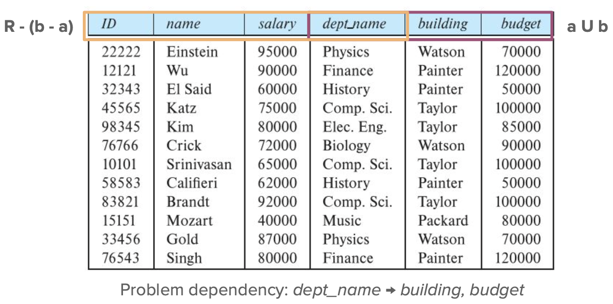

[Content](#content)
- [6. DB Design: Entity-Relationship Model](#6-db-design-entity-relationship-model)
  - [Designing Schemas](#designing-schemas)
    - [Step 1: Specifications](#step-1-specifications)
    - [Step 2: Conceptual Design](#step-2-conceptual-design)
    - [Step 3: Logical Design](#step-3-logical-design)
    - [Step 4: Physical Design](#step-4-physical-design)
    - [Design Pitfalls](#design-pitfalls)
  - [Entity Relationship Model](#entity-relationship-model)
    - [Entity \& Entity Set](#entity--entity-set)
  - [Relationship \& Relationship Sets](#relationship--relationship-sets)
      - [Degree of a Relationship Set](#degree-of-a-relationship-set)
    - [Attributes](#attributes)
  - [Mapping Cardinality](#mapping-cardinality)
- [7. Relational Database Design](#7-relational-database-design)
  - [Decomposition](#decomposition)
  - [Normalization](#normalization)
    - [Functional Dependencies](#functional-dependencies)
    - [Closures](#closures)
    - [Decomposition with Functional Dependencies](#decomposition-with-functional-dependencies)
    - [Normal Forms](#normal-forms)
      - [Boyce-Codd Normal Form (BCNF)](#boyce-codd-normal-form-bcnf)
      - [BCNF Tradeoffs](#bcnf-tradeoffs)
      - [Third Normal Form (3NF)](#third-normal-form-3nf)
      - [BCNF vs 3NF](#bcnf-vs-3nf)
- [17. Transactions](#17-transactions)
  - [ACID Properties](#acid-properties)
    - [Committing to Storage](#committing-to-storage)
    - [Transaction States](#transaction-states)
    - [Concurrent Transactions](#concurrent-transactions)
  - [Transaction Schedules](#transaction-schedules)
    - [Serializability](#serializability)
      - [Precedence Graphs](#precedence-graphs)
## 6. DB Design: Entity-Relationship Model

### Designing Schemas
#### Step 1: Specifications
- Discuss the project with users, experts in the field, etc., to find out what specific needs the project has.

#### Step 2: Conceptual Design
- Choose a data model: E-R model
- Figuring out the conceptual schema
  - What information do we need to store to perform all the required tasks?
  - What things(entities) are we capturing in the database?
  - What relationships exist between those things?
  
#### Step 3: Logical Design
- Deciding on the database schema
- The finished conceptual schema can now be turned into a representation that fits the database system you’ll be using.
- For us, this is the relational data model behind SQLite and so many other database systems.

#### Step 4: Physical Design
- Deciding on the physical layout of the database
  -  How much storage do we need? What kind of disks are we using?
  -  How to organize files on disk, what indices we’ll need...(things in chapters 12-14)

#### Design Pitfalls
- **Redundancy**: a bad design may result in repeat information.
  - Multiple copies of data could lead to inconsistency when data is updated.
- **Incompleteness**: a bad design may make certain aspects of the
enterprise difficult or impossible to model.

### Entity Relationship Model 
- Models an enterprise as a collection of **entities** and **relationships**

#### Entity & Entity Set
- **Entity**: the real-world thing your database is concerned with, a thing we can distinguish from other things.
  - Described by a set of attributes - values that describe it and make it unique.
- **Entity set** is a set of entities of the same type that share the same
set of attributes. (like rows/tuples in a table)
  - All students, all instructors, all departments, all courses...
  - A subset of the attributes form a **primary key** of the entity set; i.e.,
uniquely identifying each member of the set.

> - Rectangles represent entity sets.
> - Attributes listed inside entity rectangle
> - Underline indicates primary key attributes

### Relationship & Relationship Sets 
- **Relationship**: an association among several entities
**Relationship Sets**
- We model connections between entities as relationships.
- A relationship set is a set of relationships of the same type, between members of the same entity sets.
- An attribute can also be associated with a relationship set.

- **Roles**
  - Entity sets of a relationship need not be distinct
  - Each occurrence of an entity set plays a “role” in the relationship
  - The labels “course_id” and “prereq_id” are called roles.

##### Degree of a Relationship Set
- Binary relationship
  - involve two entity sets (or degree two).
  - most relationship sets in a database system are binary.
- Higher degree relatioships
  - Relationships between more than two entity sets are rare.
  - There are occasions when it is more convenient to represent relationships as non-binary.
  - Example: students work on research projects under the guidance of an instructor.
  - relationship ***proj_guide*** is a ternary relationship between instructor, student, and project
  - E-R Diagram with a Ternary Relationship

#### Attributes
- **Simple** attributes are not split up; 
- **Composite** attributes can be split up into subparts (component
attributes)
  - e.g. name vs first_name and last_name.
- **Single-valued** attributes have one value per entity
- **Multivalued** may have differing numbers of values.
  - e.g. Phone numbers or email addresses.
- **Derived** attributes can be calculated from other attributes.
  - e.g. age can be derived from your birthday and the current date.
**Domain** – the set of permitted values for each attribute

### Mapping Cardinality
We may want to place constraints on how many relationships of a kind one entity can have.
For binary relationships between entity sets A and B, mapping cardinality can be:
- **One to one**: An entity from A can link to at most one entity from B, entity from B can link to at most one entity from A.
- **One to many**: entity from A can link to as many entities from B as it wants, but entity from B can link to at most one entity from A.
- **Many to one**: Like one to many, but swap A and B.
- **Many to many**: No restrictions on how many relationships either A or B
can have.

<table>
<tr>
<td>

</td>
<td>

</td>
</tr>
</table>

- drawing either a directed line (→) “one,” or an undirected line (—) “many,” between the relationship set and the entity set.

<table>
<tr>
<td>
One-to-One
</td>
<td>
One-to-many
</td>
<tr>
<td>

</td>
<td>

</td>
</tr>
</table>

**Keys on Entity Sets**
- A **primary key** is some attribute or attributes that must be unique across all entities/relationships in the set.
- No two entities are allowed to have the same values for all attributes in the primary key.
  
**Keys on Relationship Sets**
- The database also needs to distinguish between relationships within a set.
- Relationships link entities that have primary keys
 - f A and B are linked, the relationship is (primary key of A) U (primary key of B).
- If the relationship has to store other attributes, union them with the above.
- This is just how you represent the relationship itself - the primary key of the relationship set depends on its cardinality.
  - **One to one**: Use either side’s primary key.
  - **One to many/many to one**: Use the primary key from the ‘many’ side.
  - **Many to many**: Use the primary key from both entity sets.

**Weak Entities**
- entities that aren’t conceptually independent - they can’t exist by themselves.
- weak entities aren’t identifiable by their own attributes.
- use the primary (foreign) key of the identifying entity, plus some discriminator attributes, to identify it uniquely.
  

**Total participation**
- (indicated by double line): every entity in the entity set
participates in at least one relationship in the relationship set
- e.g participation of student in advisor relation is total: every student must have an associated instructor

**Partial participation**:some entities may not participate in any relationship in the relationship set
• Example: participation of instructor in advisor is partial

**Redundant Attributes**
- During the design process, we might create relationships that cause information to be duplicated.
- If I create the instructor and department sets, then the relationship that pairs an instructor with a department, I might duplicate the department name.
- To fix this, we’d remove the redundant dept_name attribute from Instructor.
- Depending on the relationship, we might have to add that attribute back (as a foreign key) when we convert to a schema!

**Summary**
- The entity-relationship model helps design databases by **mapping entities** and the logical relationships between them.
- We can build a database schema by determining the specifications for our database, creating an E-R diagram, and converting it to a schema.
- The E-R diagram also explains details like complex attributes, mapping cardinality, primary keys, and which entities are weak or strong.

## 7. Relational Database Design
A Good Database Design...
- Stores all the information we need.
- Lets us retrieve that information easily.
- Doesn’t store redundant information.

### Decomposition
- if our schema is redundant, break it apart until the pieces have no redundancy - decomposition
  - could mean breaking links in our data
  - careless decomposition erases important information

Let $R$ be a relation schema and let $R_1$ and $R_2$ form a
decomposition of $R$. That is $R = R_1 \cup R_2$.

The decomposition is **lossless** if
- there is no loss of information by replacing R with the two relation schemas $R_1 \cup R_2$
  - Formally, $\Pi_{R_1}(r) \Join \Pi_{R_2}(r) =r$
  - Natural join of $R1$ and $R2 = R$
- a decompositino is **lossy** if
  - $r \subset \Pi_{R_1}(r) \Join \Pi_{R_2}(r) =r$
  - have extra tuples

### Normalization 
To create a ‘good’ relational schema:
- Take a starting schema.
- Determine if it’s in a normal form (which helps determine its ‘goodness’).
- If not: Decompose it **losslessly** into smaller schemas that are **in normal form**.

#### Functional Dependencies
- There are usually a variety of constraints (rules) on the data
in the real world.
- These rules can be expressed as functional dependencies - a more general expression of a **key**.
- Given attribute sets $a ⊆ R$ and $b ⊆ R$:
  - A functional dependency $(a → b)$ says when two records have
the same values for a, they also have the same values for b.
  - (The dependency **holds** on R if this is true for any **legal instance** of R.)

- A **legal instance** of the relation = an instance of a relation that satisfies all such rules;
- A **legal instance of a database** is one where all the relation instances are legal instances

- A functional dependency might be satisfied by a particular instance of a relation, but might not hold for every possible legal instance!
- There are also **trivial** dependencies that hold no matter what relation you have.
  -  For $a → b$, anything where b is a subset of a is trivial.
  -  e.g. ID → ID; or (dept_name, budget) → budget.
  
#### Closures
- Some functional dependencies may imply others.
- If we have $a → b$ and $b → c$, then $a → c$ as well. (transitive)
- For a set of functional dependencies $F$, its closure $F^+$ is the set of functional dependencies **implied by F** (which includes everything in F).

#### Decomposition with Functional Dependencies
- Functional dependencies can tell us if a decomposition would be lossless.
- Given a schema $R$, a decomposition into $R1$ and $R2$, and functional dependencies $F$:
- The decomposition is lossless if either one of these is in F+:
  - $R1 ∩ R2 → R1$
  - $R1 ∩ R2 → R2$
- In other words: if the shared attributes form a superkey on either R1 or R2.

- $K$ is a **superkey** for relation schema $R$ iff $K → R$.
- $K$ is a **candidate key** for $R$ iff
  - $K → R$, and
  - for no $α ⊂ K, α → R$ (subset of K is not superkey)

- In a decomposition like this where $R1 ∩ R2 → R1$, we have to enforce a few rules to make sure it stays lossless:
- $R1 ∩ R2$ is the primary key of $R1$.
- $R1 ∩ R2$ is a foreign key in $R2$, referencing R1.

#### Normal Forms
- A schema is in some normal form if it meets specific requirements 
  - usually ones that enforce a good design (efficient access to information, no redundancy, etc).

##### Boyce-Codd Normal Form (BCNF) 
- **Goal: to eliminate all redundancy** from functional dependencies.
- For a schema $R$ and a functional dependency set $F$, $R$ is in BCNF if:
  -  For all dependencies $a → b$ in $F^+$ (where $a ⊆ R$ and $b ⊆ R$), either:
     -  $a → b$ is trivial, or
     -  $a$ is a superkey of $R$.

<table>
<tr>
<td>

</td>
</tr>
</table>

This relation is not in BCNF because
- *dept_name → building, budget* holds on *in_dep* (not trivial)
- but *dept_name* is not a superkey 

**Decomposing into BCNF**
If schema R it not in BCNF, then there’s some FD $α → β$ that isn’t trivial and where a isn’t a superkey. We decompose R into:
- $\alpha \cup \beta$, and
- $R - (\beta - \alpha)$
- (If one of these isn’t in BCNF either, repeat until it is!)
- In our example of *in_dep*,
  - $α$ = *dept_name*
  - $β$ = *building, budget*
  - and *in_dep* is replaced by
  - $(α \cup β )$ = ( *dept_name, building, budget* )
  - $(R-(β- α))$ = ( *ID, name, dept_name, salary* )
  

<table>
<tr>
<td>

</td>
<td>

</td>
</tr>
</table>

##### BCNF Tradeoffs
Suppose students can have multiple advisors, but only one per department.
- dept_advisor (s_ID, i_ID, dept_name) has the dependencies:
  - *i_ID → dept_name* 
  - *s_ID, dept_name → i_ID*
- Decomposing with BCNF, we get:
  - *(s_ID, i_ID)*
  - *(i_ID, dept_name)*
- But now no schema has all the attributes in the original dependency - to check it, we have to join tables.

##### Third Normal Form (3NF)
- to preserve functional dependencies
- The criteria for 3NF ≈ BCNF + 1 more possibility
- For a schema $R$ and a functional dependency set $F$, $R$ is in 3NF if: 
  - For all dependencies $a → b$ in $F^+$ (where $a ⊆ $R and $b ⊆ R$):
    - $a → b$ is trivial, or
    - $a$ is a superkey of $R$, or
    - every attribute in $(b - a)$ is part of a **candidate key** for $R$.
  
- $K$ is a **candidate key** for $R$ iff
  - $K → R$, and
  - for no $α ⊂ K, α → R$ (subset of K is not superkey)

<table>
<tr>
<td>

</td>
</tr>
</table>

##### BCNF vs 3NF
- 3NF is always achievable without losing the ability to check dependencies efficiently.(BDNF can't sometimes)
- But, keeping those functional dependencies means we might have to **use nulls** to represent relationships 
  - (e.g. the department with no instructors); 
- we may also **still have some redundancy** compared to BCNF.

## 17. Transactions

A transaction is a unit of program execution, can be a sequence of instructions (SQL commands or code accessing the database)

A transaction must end in one of two ways:
- it completes entirely and ends with a **commit**, saving all the
changes it made; or,
- it fails to complete and ends with a **rollback**, undoing all the
changes it made.

### ACID Properties
- **A**tomicity (all or nothing)
- **C**onsistency (an isolated transaction preserves database consistency)
- **I**solation (a transaction is unaware of other transactions on the system)
- **D**urability (a committed transaction persists through system failures)

**Atomicity**
- "all or nothing"
- a transaction must finish entirely or not at all
- error-tolerant 

**Isolation**
- enable running **concurrent/parallel transactions** of multiple users without interfering each other
  
**Durability**
- a committed transaction **persists through future system failures**
- 
**Consistency**
- a transaction in isolation should **preserve any constraints** on the database
- A transaction might break a constraint temporarily, but by the time it commits the constraints should be restored.

#### Committing to Storage
Two major storage categories:
- **Volatile storage** like the cache or main memory - fast, but stored data is lost when power goes out, and
- **Non-volatile storage** like magnetic disks or solid-state drives - slower, but they keep data even if power is lost.
- A third: **Stable storage**, which can never lose data.
- Stable storage is useful for durability (so our changes persist) and atomicity (so we can write changes to a log file before making them).

**Aborted Transactions**
- Anything that keeps a transaction from executing causes us to **abort** the transaction - forcing us to undo any changes we made.
- keep a **log file** where we record the changes we make - once the changes are written to the file, we can start modifying the database itself.
- Once a transaction is committed, we can’t abort it - we can only start a second transaction that modifies the database to undo the changes.

#### Transaction States
- **Active** -- the initial state; the transaction stays in this state while it is executing
- **Partially committed** -- after the final statement has been executed, no onger executing, but can still be rolled back.
- **Commited** -- after successful completion. If we can write enough out to disk to recreate the changes if there’s a system failure.
- **Failed** --  when normal execution can no longer proceed. If a transaction fails before committing, any changes must be rolled back.
- **Aborted** -- once the transaction has been rolled back and those changes are undone. (could be either restarted or abandoned).
- 

**External Writes**
- We want to avoid any situations where users see confirmation of a change and then the change gets erased by a crash.
- We prefer to hold off on announcing any changes until the transaction commits - then, even if we crash, we can make sure the changes are saved.

#### Concurrent Transactions
- Multiple transactions are allowed to run concurrently in the system. Advantages are:
- Increased processor and disk utilization, leading to better transaction throughput
  - one transaction can be using the CPU while another is reading from or writing to the disk
- Reduced average response time for transactions: short transactions need not wait behind long ones.
- 
**Isolation Difficulties**
- **Concurrency control system** manages the difficult task of determining what transactions can run at the same time, and how.
- mechanisms to achieve isolation -- control the interaction among the concurrent transactions in order to prevent them from destroying the consistency of the database
- When multiple transactions access the same data at once, the order of their operations could result in interference with each other (and break database consistency).

### Transaction Schedules

- **Schedules** consist of
  - All the operations in those transactions,
  - in the order they appear in their individual transaction,
  - each one (optionally) ending with a commit or an abort.
- Multiple transactions can be interleaved so their operations can run in parallel.

- **Serial schedule**
- first T1, then T2.

<table>
<tr>
<td>

</td>
<td>

</td>
</tr>

<tr>
<td>
Equivalent non serial,  the sum A + B is preserved

</td>
<td>
Not equivalent, doesn't preserve the value of (A +
B )

</td>
</tr>
</table>

#### Serializability
- Basic Assumption – Each transaction should preserves database consistency.
- Serial execution of a set of transactions preserves database consistency.
- A (possibly concurrent) schedule is **serializable** if it is equivalent to a serial schedule.

**Serializable Schedules**
- How do we determine whether a schedule can be serialized:
- The only operations that matter on an **item X** are **read(X)** and **write(X)**.
- If I have two consecutive instructions from two different transactions, can I safely swap the order of...
  - read(X) and read(X)?
    - Yes; they’ll both read the same thing.
  - read(X) and write(X)?
    - No; the write could affect the value the read gets.
  - write(X) and read(X)?
    - No; for the same reason.
  - write(X) and write(X)?
    - No; one will overwrite the other.

**Conflict Serialization**
- Two operations conflict if they’re from **different transactions**, operate on the **same item**, and one is a **write** operation.
- **Conflict equivalent**: Given two consecutive instructions from different transactions, as long as they don’t conflict, we can **swap their ordering** and get a schedule that produces the same output as the original. 
- if I can turn a schedule into a serial schedule by doing this, that schedule is **conflict serializable**.

##### Precedence Graphs
- To test which schedules are serializable, we can create a **precedence graph** 
- a directed graph for finding schedule conflicts.
- Each vertex of the graph is a transaction. We draw an edge from Ti to Tj wherever:
  -  Ti writes X before Tj reads X.
  -  Ti reads X before Tj writes X.
  -  Ti writes X before Tj writes X.
-  If there’s a cycle in the graph, it isn’t conflict serializable.

**Cascading Failures/Rollbacks**
- If two transactions Ti and Tj are running concurrently and Ti fails:
  - If Ti wrote something that was read by Tj, that write would be rolled back and undone with Ti.
  - To keep data consistent, Tj has to abort as well
  - And if something else ran at the same time as Tj, that one also has to abort, and so on
- Can lead to the undoing of a significant amount of work

**Recoverable Schedules**
- If Tj reads something that was written by Ti, Ti commits before Tj does
- Then if Ti fails, we can safely abort Tj.

**Cascadeless Schedules**
- cascading rollbacks cannot occur;
- if Tj reads something written by Ti , Ti commits before Tj reads that data.
- This ensures Ti either commits (and Tj can read the modified data safely) or aborts (in which case Tj reads the unmodified data).
- Any cascadeless schedule is also a recoverable schedule
