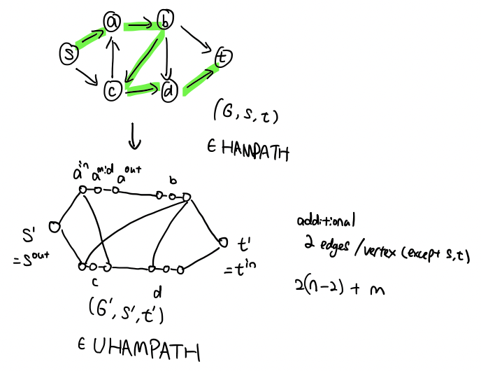
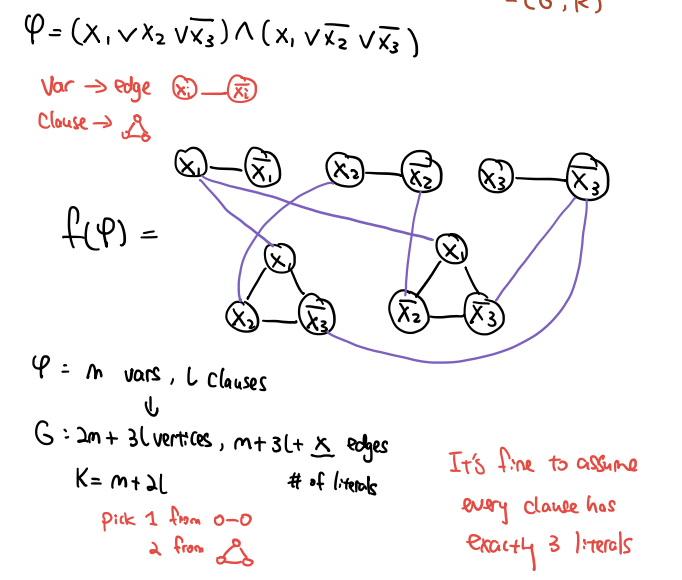
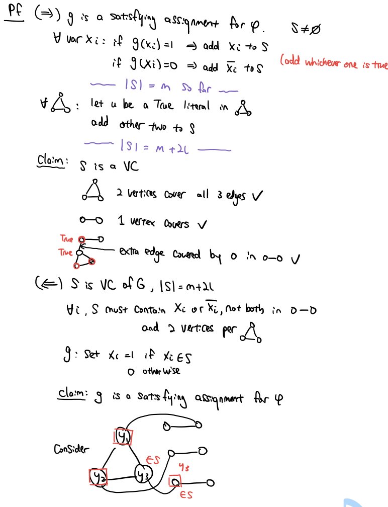
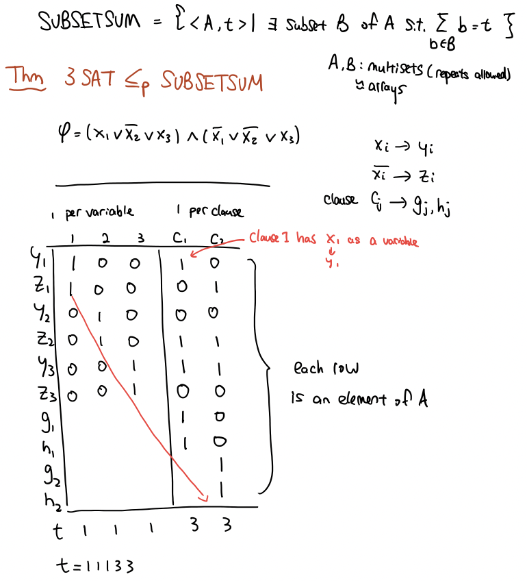
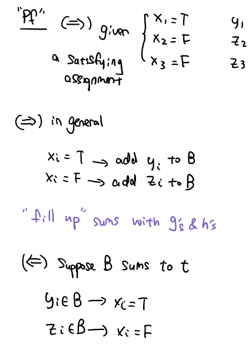

#### Reductions
- $A≤B$: Given a decider for B, design a M decider for A. 
  - (It is very likely that M should call the decider for B, possibly multiple times.) 
To explain correctness, show 
    - (1) if the input to M is in A => then M accepts it, 
    - (2) if the input to M is not in A => then M rejects it.
- $A≤_mB$: Give a "mapping reduction" $f$ from $A$ to $B$. 
  - This involves giving an algorithm f, whose input is a string and output is a string, such that 
  - (1) if $x \in A$ then $ f(x) \in B$
  - (2) $x \notin A$ then $ f(x) \notin B$

Other undecidable:
- $ALL_{CFG}$
  - Show $A_{TM}≤ALL_{CFG}$
- $EQ_{CFG}$
  - Show $ALL_{CFG} ≤ EQ_{CFG}$

```
Let R be decider for $EQ_{CFG}$, 
Decider S for $ALL_{CFG}$ \<G>:
  Let G' = "a CFG with start var = S, for each terminal x in ∑, G' has a rule S -> xS, and G' has rule S->ε. (L(G') = Σ*)"
  Run R on <G, G'>
  If R accepts: accepts, else rejects
```

- $EQ_{CFG}$ is co-Turing-recognizable, ie $\overline{EQ_{CFG}}$ is Turing-recognizable
- 

#### Polynomial Reductions
A mapping reduction that runs in polynomial time.
**Mindset for showing A ≤p B:**
Find **f** s.t. the following is a poly-time decider for A:
```
ALG_A(x):
  y=f(x)
  return ALG_B(y)
```

##### In class:
SAT, HamPath, UHamPath ∈ NP-complete

- SAT ≤ HamPath ≤ UHamPath
- SAT ≤ 3SAT ≤ VC ≤ IS
- 3SAT ≤ SubsetSum


**HamPath ≤ UHamPath**
```
f(x):
  G,s,t = x
  for eavh u in V\{s,t}: 
    add u_in, u_mid, u_out to V(G')
    add {u_in, u_mid}, {u_mid, u_out} to E(G')
  add s_out, t_in to V(G')
  for each {u, v} in E(G):
    add {u_out, v_in} to E(G')
  return (G', s_out, t_in)

```
(G,s,t) in HamPath - n vertices, m edges
(G',s',t') in UHamPath - 3(n-2)+2 vertices, 2(n-2)+m edges



**SAT ≤ 3SAT**
SAT = {⟨φ⟩ | φ is a satisfiable Boolean formula}
3SAT = {⟨φ⟩ | φ is a satisfiable BF of form clause∧...∧clause, each has ≤ 3 literals joined by ∨}
```
f(x):
  
```
**VC ≤ IS**
VC = {<G, k> | G has VC of size ≤k}
IS = {<G, k> | G has IS of size ≥k}
```
f(G, k):
  return (G, n-k) 
```
(=>) (G, k)∈ VC => ∃VC S s.t |S| ≤ k => ∀{u,v}∈E, u∈E or v∈E. Consider S' = V\S, then |S'|≥n-k. For contradiction, sps S' not an IS, then ∃{u,v}∈E s.t. u & v both in S' => then u & v both not in S => S is not VC [Contradiciton].
(<=) similar

**3SAT ≤ VC**
φ satisfiable <=> f(φ) ∈ VC
```
f(φ): G = empty graph
  for each variable xi in φ:
    add [x_i]-[not x_i] to G (2 nodes connected)
  for each clause y1∧y2∧y3 in φ:
    add ∆ [y1]-[y2]-[y3] to G (connected triangle ∆)
  for each vertex u in ∆:
    add edge b/t u and correponding literal from O-O pair 
  return (G, m+2l) # # vars + # clauses
```


**3SAT ≤ SubsetSum**




##### Other:
**VC ≤ DomSet**  
**HamPath ≤ HamCycle**


PATH ∈ P
COMPOSITES ∈ NP
CLIQUE ∈ NP

#### Textbook:
**3SAT ≤p B, to show B is NP-hard**

CLIQUE = {⟨G, k⟩| G is an undirected graph with a k-clique}.
A clique in an undirected graph is a subgraph that's complete. A k-clique is a clique that contains k nodes.

**3SAT ≤ CLIQUE**
```
f(x):
    for every clause ci, add all 3 literals to G as a triplet of vertices 
    (# of triplets = # of clauses = k)
    add edge between every pair of vertices except: 
      vertices in the same triplet,
      vertices that has the opposite labels eg $x, \overline x$
    return G, k
```
    


